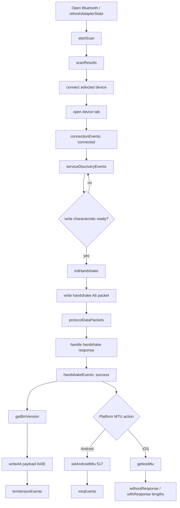

# flutter_elink_ble

[中文 README](README_ZH.md)

Flutter plugin for the ElinkThings BLE SDK. The Dart API exposes Bluetooth adapter state, scanning, connection lifecycle, protocol data callbacks, characteristic events, Elink protocol helpers, and Dart-side WiFi provisioning helpers.

Native code delegates scan, connect, disconnect, and write operations to the official Elink SDK:

- Android: `AILinkBleManager` from `AILinkSDKRepositoryAndroid`
- iOS: `ELAILinkBleManager` from `AILinkBleSDK.framework`

WiFi provisioning commands are built in Dart and sent through the shared `writeA6` path, so Android and iOS use the same command payloads and response parsing.

## Features

- Listen to Bluetooth state with `ElinkBle.bluetoothState` or `ElinkBle.setBluetoothStateCallback`.
- Scan Elink broadcast and connectable devices.
- Parse `CID`, `VID`, `PID`, and `MAC` from Elink manufacturer data.
- Connect multiple BLE devices, disconnect by `remoteId`, and write BLE data
  through the native SDK.
- Send A6 and A7 payloads with `ElinkBle.writeA6()` and `ElinkBle.writeA7()`.
- Receive SDK A6/A7 payload callbacks through `ElinkBle.protocolDataPackets`.
- Receive passthrough or non-protocol data through `ElinkBle.passthroughDataPackets`.
- Receive low-level characteristic events through `ElinkBle.characteristicEvents`.
- Request Android MTU changes and read iOS maximum write lengths.
- Configure Android SDK command resend count from Flutter. It is disabled by
  default and enabled when `resendCount >= 1`.
- Run WiFi provisioning commands from Dart and listen for typed WiFi events.
- Use native SDK helpers for broadcast decrypt and MCU A7 encrypt/decrypt; handshake is handled uniformly in the Flutter A6 data layer.

## Installation

Install with the Flutter command:

```bash
flutter pub add flutter_elink_ble
```

Or add it manually to `pubspec.yaml`:

```yaml
dependencies:
  flutter_elink_ble: ^0.2.0
```

## Android Setup

The Android implementation initializes the Elink native SDK and bridges SDK callbacks to Dart. It does not implement its own BLE scanning or connection logic.

If the host project does not already include JitPack, add it:

```gradle
allprojects {
    repositories {
        google()
        mavenCentral()
        maven { url 'https://jitpack.io' }
    }
}
```

The plugin manifest declares BLE permissions, but the host app must still request runtime permissions for the current Android version:

```xml
<uses-feature android:name="android.hardware.bluetooth_le" android:required="false" />
<uses-permission android:name="android.permission.BLUETOOTH_SCAN" android:usesPermissionFlags="neverForLocation" />
<uses-permission android:name="android.permission.BLUETOOTH_ADVERTISE" />
<uses-permission android:name="android.permission.BLUETOOTH_CONNECT" />
<uses-permission android:name="android.permission.BLUETOOTH" android:maxSdkVersion="30" />
<uses-permission android:name="android.permission.BLUETOOTH_ADMIN" android:maxSdkVersion="30" />
<uses-permission android:name="android.permission.ACCESS_FINE_LOCATION" android:maxSdkVersion="30" />
<uses-permission android:name="android.permission.ACCESS_COARSE_LOCATION" android:maxSdkVersion="28" />
<uses-permission android:name="android.permission.FOREGROUND_SERVICE" />
<uses-permission android:name="android.permission.FOREGROUND_SERVICE_CONNECTED_DEVICE" />
```

Android 12 and later must request `BLUETOOTH_SCAN`, `BLUETOOTH_ADVERTISE`, and `BLUETOOTH_CONNECT`; the ordinary AILink SDK scan entry checks the complete Nearby devices permission set. Android 11 and earlier usually require location permission for BLE scanning.

## iOS Setup

Add Bluetooth usage descriptions to the host app `Info.plist`:

```xml
<key>NSBluetoothAlwaysUsageDescription</key>
<string>Need BLE permission to scan and connect Elink devices.</string>
<key>NSBluetoothPeripheralUsageDescription</key>
<string>Need BLE permission to scan and connect Elink devices.</string>
```

The plugin currently vendors `AILinkBleSDK.framework`. The sample framework contains an `arm64` device slice, so it is suitable for real device builds. For simulator builds, replace it with an `AILinkBleSDK.xcframework` that includes simulator slices.

`AILinkBleSDK.framework` is a static archive and contains Objective-C categories such as `ELAILinkBleManager+WIFI`. The plugin podspec injects `-ObjC` into the Pod target so those category methods are linked into `flutter_elink_ble.framework`. Run `pod install` again after updating the plugin; otherwise runtime may fail with `unrecognized selector`.

Each iOS connection is handled by its own `ELAILinkBleManager` session so the SDK's current peripheral state is not shared across connected devices. When connecting from a recent scan result, the plugin first tries to retrieve the target `CBPeripheral` by identifier through that session's `CBCentralManager`; if it cannot be retrieved, it falls back to a session-local scan for the same `remoteId`.

If Bluetooth is on but scanning fails on iOS, check the host app permission text and the app's Bluetooth permission in iOS Settings. Native errors are normalized as `bluetooth_off`, `bluetooth_unauthorized`, `bluetooth_unsupported`, or `bluetooth_not_ready`.

## Quick Start

```dart
import 'package:flutter_elink_ble/flutter_elink_ble.dart';

final supported = await ElinkBle.isSupported;
await ElinkBle.openBluetooth();
await ElinkBle.refreshAdapterState();

final stateSub = ElinkBle.bluetoothState.listen((state) {
  print('Bluetooth state: ${state.name}');
});

ElinkBle.setBluetoothStateCallback((state) {
  print('Bluetooth callback: ${state.name}');
});

final scanSub = ElinkBle.scanResults.listen((results) {
  for (final result in results) {
    print(
      '${result.device.remoteId} '
      '${result.device.macAddress} '
      'CID=${result.advertisementData.identity.cidValue}',
    );
  }
});

await ElinkBle.startScan(
  timeout: const Duration(seconds: 10),
  androidScanMode: ElinkAndroidScanMode.lowLatency, // Android only.
);
```

## Example BLE Flow

The example app follows this order for scanning, connecting, handshake, BM
version, and MTU handling:



In the example implementation:

- Scan uses `ElinkBle.startScan()` and `ElinkBle.scanResults`.
- Connection readiness is tracked by `ElinkBle.connectionEvents` and
  `ElinkBle.serviceDiscoveryEvents`.
- `ElinkBle.connect()` does not stop active scanning in the plugin. The example
  stops its current scan before connecting the selected device, then creates one
  tab per connected device and automatically switches to the new tab.
- Device operations are routed by `remoteId`, so writes, MTU, RSSI, WiFi
  provisioning, and disconnect actions target the current device tab.
- Handshake starts after a writable characteristic is discovered.
- BM version is queried with `ElinkBle.getBmVersion()`, which sends A6 payload
  `0x0E`.
- Android uses `ElinkBle.setAndroidMtu(remoteId, 517)` and listens to
  `ElinkBle.mtuEvents`.
- iOS uses `ElinkBle.getIosMtu(remoteId)` and reads the negotiated
  `.withoutResponse` and `.withResponse` maximum write lengths.

Connect and write:

```dart
await ElinkBle.stopScan(); // Example UI stops the current scan before connecting.
await ElinkBle.connect(result.device);

await ElinkBle.writeA6(result.device.remoteId, [0x01, 0x02]);

await ElinkBle.writeA7(result.device.remoteId, [0x03, 0x04], cid: 0x1234);

await ElinkBle.write(
  result.device.remoteId,
  ElinkDataProcessor.wrapA6Frame([0x01, 0x02]),
);

await ElinkBle.readRssi(result.device.remoteId);

// Android only: request GATT MTU. Result is emitted by ElinkBle.mtuEvents.
await ElinkBle.setAndroidMtu(result.device.remoteId, 247);

// Android only: command resend is disabled by default; 0 disables it again.
await ElinkBle.setAndroidCommandResendCount(resendCount: 3);
await ElinkBle.setAndroidCommandResendCount();

// iOS only: read CoreBluetooth maximum write lengths for the target connection.
final iosMtu = await ElinkBle.getIosMtu(result.device.remoteId);
print(
  'iOS write lengths: '
  'withoutResponse=${iosMtu.maxWriteWithoutResponse} '
  'withResponse=${iosMtu.maxWriteWithResponse}',
);

// Android only: set preferred PHY.
await ElinkBle.setAndroidPreferredPhy(
  result.device.remoteId,
  txPhy: ElinkAndroidPhy.phy2M,
  rxPhy: ElinkAndroidPhy.phy2M,
);

await ElinkBle.disconnect(result.device.remoteId);
```

## WiFi Provisioning

WiFi APIs are implemented in Dart. The plugin builds A6 payloads using one shared command builder and sends them through the native SDK `writeA6` bridge. Command logs are disabled by default and can be enabled with `ElinkBle.wifiCommandLoggingEnabled`.

For devices that must register with the server before provisioning is considered successful, use `wifiConfigureServerAndConnect`; it writes server host, port, and path before sending the WiFi MAC, password, and connect command.

```dart
final wifiEventsSub = ElinkBle.wifiEvents.listen((event) {
  print('${event.type} ${event.remoteId} ${event.value}');
});

final wifiScanSub = ElinkBle.wifiScanResults.listen((accessPoints) {
  for (final accessPoint in accessPoints) {
    print('${accessPoint.ssid} ${accessPoint.macAddress} ${accessPoint.rssi}');
  }
});

final wifiStatusSub = ElinkBle.wifiStatusEvents.listen((status) {
  print(
    'ble=${status.bleStatus.name} '
    'wifi=${status.wifiStatus.name} '
    'work=${status.workStatus.name}',
  );
});

final wifiResponseSub = ElinkBle.wifiResponseEvents.listen((response) {
  print('command=${response.command} status=${response.status.name}');
});

ElinkBle.wifiCommandLoggingEnabled = true;

await ElinkBle.wifiGetCurrentState(result.device.remoteId);
await ElinkBle.wifiScan(result.device.remoteId);

await ElinkBle.wifiConfigureServerAndConnect(
  result.device.remoteId,
  host: 'ailink.iot.aicare.net.cn',
  port: 80,
  path: '',
  macAddress: 'AA:BB:CC:DD:EE:FF',
  password: '12345678',
);

await ElinkBle.wifiGetConnectedSsid(result.device.remoteId);
await ElinkBle.wifiGetConnectedMac(result.device.remoteId);
await ElinkBle.wifiGetConnectedPassword(result.device.remoteId);
await ElinkBle.wifiGetDeviceSn(result.device.remoteId);

await ElinkBle.wifiGetServerInfo(result.device.remoteId);
```

Release WiFi subscriptions when done:

```dart
await wifiEventsSub.cancel();
await wifiScanSub.cancel();
await wifiStatusSub.cancel();
await wifiResponseSub.cancel();
ElinkBle.wifiCommandLoggingEnabled = false;
```

## Protocol Helpers

Generic A6/A7 frame parsing and A7/TLV packet building:

```dart
final commonFrame = ElinkDataProcessor.parseProtocolFrame(
  ElinkDataProcessor.wrapA6Frame([0x0E]),
);
print('${commonFrame.protocol.name} ${commonFrame.payload}');

// Full A7 frame: A7 + CID(2) + payloadLength + TLV payload + checksum + 7A.
final frame = ElinkDataProcessor.parseA7Frame([
  0xA7, 0x00, 0x8F, 0x08,
  0x01, 0x06, 0x67, 0xA7, 0x1F, 0x0E, 0x01, 0x08,
  0xE2, 0x7A,
]);
final tlvs = ElinkDataProcessor.parseTlvPayload(frame.payload);
final timestamp = tlvs.first.readInt(length: 4); // Big-endian by default.

final request = ElinkDataProcessor.wrapA7TlvFrame(
  cid: 0x008F,
  tlvs: [
    ElinkPayload(type: 0x02), // L=0, no V.
    ElinkPayload(type: 0x03, data: [0x01, 0x01]),
  ],
);
await ElinkBle.write(result.device.remoteId, request);

final payloadChunks = ElinkDataProcessor.buildTlvPayloadChunks(
  [
    ElinkPayload(type: 0x02),
    ElinkPayload(type: 0x03, data: [0x01, 0x01]),
  ],
  maxPayloadLength: 20,
);
for (final payload in payloadChunks) {
  final chunkRequest = ElinkDataProcessor.wrapA7Frame(
    cid: 0x008F,
    payload: payload,
  );
  await ElinkBle.write(result.device.remoteId, chunkRequest);
}

print(ElinkDataProcessor.formatHex(request)); // A7 00 8F ...
```

Listen for protocol, passthrough, and characteristic callbacks:

```dart
final protocolSub = ElinkBle.protocolDataPackets.listen((packet) {
  print('${packet.protocol.name} ${packet.deviceType} ${packet.data}');
});

final passthroughSub = ElinkBle.passthroughDataPackets.listen((packet) {
  print(packet.data);
});

final characteristicSub = ElinkBle.characteristicEvents.listen((event) {
  print('${event.operation.name} ${event.characteristicUuid}');
});

final rssiSub = ElinkBle.rssiEvents.listen((event) {
  print('${event.remoteId} ${event.rssi}');
});

final mtuSub = ElinkBle.mtuEvents.listen((event) {
  print('${event.remoteId} ${event.mtu} ${event.availableMtu}');
});
```

Release resources when done:

```dart
await stateSub.cancel();
await scanSub.cancel();
await protocolSub.cancel();
await passthroughSub.cancel();
await characteristicSub.cancel();
await rssiSub.cancel();
await mtuSub.cancel();
await ElinkBle.disconnect(result.device.remoteId);
await ElinkBle.dispose();
```

## Default Elink UUIDs

| Purpose | UUID |
| --- | --- |
| Broadcast device service | `F0A0` |
| Connectable device service | `FFE0` |
| Write characteristic | `FFE1` |
| Notify characteristic | `FFE2` |
| Write + notify characteristic | `FFE3` |

## Event Contract

Native events are normalized into these Dart streams:

| Native type | Dart API | Description |
| --- | --- | --- |
| `adapterState` | `ElinkBle.adapterState`, `ElinkBle.bluetoothState` | Bluetooth state |
| `scanResult` | `ElinkBle.scanResults` | Scan results deduplicated by remoteId |
| `scanStopped` | `ElinkBle.isScanning` | Scan stopped or timed out |
| `connectionState` | `ElinkBle.connectionEvents` | GATT connection state |
| `servicesDiscovered` | `ElinkBle.serviceDiscoveryEvents` | Service and characteristic discovery result |
| `protocolData` | `ElinkBle.protocolDataPackets`, `ElinkBle.wifiEvents` | SDK A6/A7 payload callback; WiFi A6 payloads are also parsed by Dart |
| `passthroughData` | `ElinkBle.passthroughDataPackets` | SDK passthrough or non-protocol data |
| `characteristicEvent` | `ElinkBle.characteristicEvents` | Low-level read, write, descriptor write, changed, or notification-state event |
| `rssi` | `ElinkBle.rssiEvents` | Connected-device RSSI read result |
| `mtu` | `ElinkBle.mtuEvents` | Android MTU change result |
| `handshake` | `ElinkBle.handshakeEvents` | Handshake result handled uniformly in the Flutter A6 layer |
| `error` | `ElinkBle.errors` | Plugin error |

WiFi-specific Dart streams:

| Dart API | Description |
| --- | --- |
| `ElinkBle.wifiEvents` | Generic WiFi events, including optional command logs |
| `ElinkBle.wifiScanResults` | WiFi access points deduplicated by MAC or scan id |
| `ElinkBle.wifiStatusEvents` | BLE, WiFi, and module work status |
| `ElinkBle.wifiResponseEvents` | WiFi command response events |

## Notes

- Check `ElinkBle.bluetoothStateNow == ElinkAdapterState.on` before scanning.
- Use `ElinkBle.openBluetooth()` to guide the user to enable Bluetooth. Android opens the system enable prompt or Bluetooth settings; iOS cannot turn Bluetooth on directly, so the plugin only refreshes current state and does not open Settings. Listen to `ElinkBle.bluetoothState` for the final state.
- Android 7.0+ throttles BLE scanning; avoid more than 5 `startScan` calls in 30 seconds. The plugin reuses an active scan with the same configuration and blocks too-fast Android restarts with `scan_throttled` and `retryAfterMs`.
- iOS `remoteId` is `CBPeripheral.identifier`, not a MAC address.
- iOS multi-device connections use one `ELAILinkBleManager` session per
  `remoteId`; always pass the target `remoteId` when writing or disconnecting.
- iOS does not support active MTU requests from apps; use the system-negotiated maximum write length instead.
- Android command resend is disabled by default. Set `resendCount >= 1` only
  when the business flow needs SDK-level retry after a failed command send.
- Android 12+ host apps must request `BLUETOOTH_SCAN`, `BLUETOOTH_ADVERTISE`, and `BLUETOOTH_CONNECT` runtime permissions themselves. Android 11 and earlier also require location permission for scanning, and system location services must be enabled.
- A6/A7 writes should use `writeA6` and `writeA7`; the native SDK adds frame headers, tails, and checksums.
- Raw `write` remains available only for business code that already builds full packets.
- WiFi command logs are disabled by default. Enable them only when debugging command payloads.
