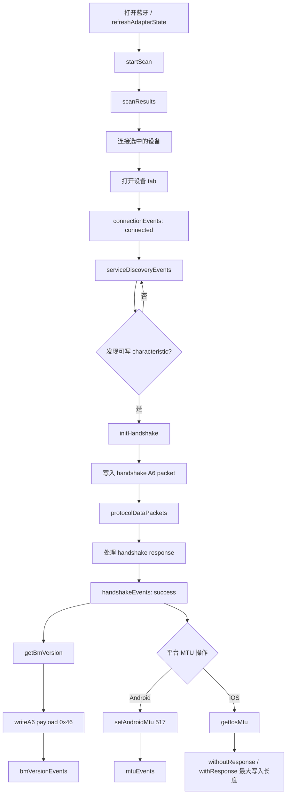

# flutter_elink_ble

[English README](README.md)

ElinkThings BLE SDK 的 Flutter 插件。用于监听 Bluetooth adapter state、扫描设备、连接设备、收发数据包，并封装 Elink 协议的广播解析、handshake、A6/A7 packet 处理与加解密 helper。

## 功能

- 监听蓝牙状态：`ElinkBle.bluetoothState`、`ElinkBle.setBluetoothStateCallback`
- 扫描 Elink 广播设备与可连接设备
- 支持连接多个 BLE 设备，按 `remoteId` 断开和写入 BLE 数据
- 接收 SDK A6/A7 payload：`ElinkBle.protocolDataPackets`
- 接收透传/非协议数据：`ElinkBle.passthroughDataPackets`
- 接收底层 characteristic 操作事件：`ElinkBle.characteristicEvents`
- 解析 Elink manufacturer data 中的 `CID`、`VID`、`PID`、`MAC`
- Android 可请求 MTU，iOS 可按 `remoteId` 查询目标连接的最大写入长度
- Flutter 可控制 Android SDK 指令发送失败重发次数，默认关闭，`resendCount >= 1` 开启
- 在 Dart 层统一构造 WiFi A6 配网指令，并通过 `writeA6` 下发
- 解析 WiFi 扫描、状态、响应、MAC、SSID、密码、SN 与服务端配置事件
- 支持 WiFi 指令日志开关，默认关闭
- 调用 native Elink SDK 完成 broadcast decrypt、MCU A7 encrypt/decrypt；handshake 在 Flutter A6 数据层统一处理

## 安装

使用 Flutter 命令安装：

```bash
flutter pub add flutter_elink_ble
```

或手动在 `pubspec.yaml` 中添加：

```yaml
dependencies:
  flutter_elink_ble: ^0.2.0
```

## Android 配置

插件包名为 `com.elinkthings.flutter_elink_ble`。Android 端会初始化 Elink native SDK，并桥接 scan、connection、service discovery、notify、write 与协议 helper 到 Dart。原生层不自行实现扫描/连接流程，扫描、连接、断开和写入统一交给 `AILinkBleManager`。

如果宿主 Android 工程还没有配置 JitPack，需要补充仓库：

```gradle
allprojects {
    repositories {
        google()
        mavenCentral()
        maven { url 'https://jitpack.io' }
    }
}
```

插件已在自身 manifest 中声明 BLE permissions，但宿主 App 仍需要按 Android 版本申请 runtime permission：

```xml
<uses-feature android:name="android.hardware.bluetooth_le" android:required="false" />
<uses-permission android:name="android.permission.BLUETOOTH_SCAN" android:usesPermissionFlags="neverForLocation" />
<uses-permission android:name="android.permission.BLUETOOTH_ADVERTISE" />
<uses-permission android:name="android.permission.BLUETOOTH_CONNECT" />
<uses-permission android:name="android.permission.BLUETOOTH" android:maxSdkVersion="30" />
<uses-permission android:name="android.permission.BLUETOOTH_ADMIN" android:maxSdkVersion="30" />
<uses-permission android:name="android.permission.ACCESS_FINE_LOCATION" android:maxSdkVersion="30" />
<uses-permission android:name="android.permission.ACCESS_COARSE_LOCATION" android:maxSdkVersion="28" />
<uses-permission android:name="android.permission.FOREGROUND_SERVICE" />
<uses-permission android:name="android.permission.FOREGROUND_SERVICE_CONNECTED_DEVICE" />
```

Android 12 及以上需要申请 `BLUETOOTH_SCAN`、`BLUETOOTH_ADVERTISE` 与 `BLUETOOTH_CONNECT`；AILink SDK 的普通扫描入口会检查完整 Nearby devices 权限。Android 11 及以下通常还需要 location permission 才能扫描 BLE。
插件 manifest 已按 SDK 文档注册 `com.pingwang.bluetoothlib.server.ELinkBleServer`，用于 SDK 前台服务连接能力。

## iOS 配置

在宿主 App 的 `Info.plist` 中添加蓝牙权限说明：

```xml
<key>NSBluetoothAlwaysUsageDescription</key>
<string>Need BLE permission to scan and connect Elink devices.</string>
<key>NSBluetoothPeripheralUsageDescription</key>
<string>Need BLE permission to scan and connect Elink devices.</string>
```

iOS 端已随插件内置 `AILinkBleSDK.framework`。扫描、连接、断开和写入统一交给 SDK 的 `ELAILinkBleManager`；插件只负责把 SDK delegate 回调桥接到 Flutter。Handshake 流程由 Flutter A6 数据层统一触发，broadcast decrypt、handshake crypto helper 与 A7 encrypt/decrypt 使用 `AILinkBleSDK` 内的 `ELEncryptTool`，避免多个 framework 暴露同名 Objective-C 类型。当前 Sample 提供的 `AILinkBleSDK.framework` 只有 `arm64` device slice，适合真机编译；如果要跑 simulator，需要替换为包含 simulator slice 的 `AILinkBleSDK.xcframework`。

`AILinkBleSDK.framework` 是静态 archive，内部包含 `ELAILinkBleManager+WIFI` 等 Objective-C category。插件 podspec 已给 Pod target 注入 `-ObjC`，更新插件后需要重新执行 `pod install`，否则运行时可能出现 `unrecognized selector`。

iOS 多连时，每个 `remoteId` 会使用独立的 `ELAILinkBleManager` session，避免 SDK 的 current peripheral 状态在多台设备之间互相覆盖。从近期扫描结果发起连接时，插件会先通过该 session 自己的 `CBCentralManager` 按 identifier retrieve 目标 `CBPeripheral`；retrieve 不到时才回退到 session 内部扫描同一个 `remoteId`。

如果 iOS 蓝牙已打开但扫描失败，先确认宿主 App 是否已加入上述权限文案，并在系统设置中允许蓝牙权限。Native 层会区分 `bluetooth_off`、`bluetooth_unauthorized`、`bluetooth_unsupported` 与 `bluetooth_not_ready`，避免把权限或初始化中的状态误报为蓝牙关闭。

## 快速使用

```dart
import 'package:flutter_elink_ble/flutter_elink_ble.dart';

final supported = await ElinkBle.isSupported;
await ElinkBle.openBluetooth();
await ElinkBle.refreshAdapterState();

final stateSub = ElinkBle.bluetoothState.listen((state) {
  print('Bluetooth state: ${state.name}');
});

ElinkBle.setBluetoothStateCallback((state) {
  print('Bluetooth callback: ${state.name}');
});

final scanSub = ElinkBle.scanResults.listen((results) {
  for (final result in results) {
    final elinkData = ElinkDataProcessor.parseAdvertisement(
      result.advertisementData.manufacturerData,
      isBroadcastDevice: result.advertisementData.isBroadcastDevice,
    );
    print('${result.device.remoteId} ${elinkData.macAddress}');
  }
});

await ElinkBle.startScan(
  timeout: const Duration(seconds: 10),
  // Android only：控制底层 ScanSettings.SCAN_MODE_*，iOS 会忽略。
  // Android only: controls ScanSettings.SCAN_MODE_*; ignored on iOS.
  androidScanMode: ElinkAndroidScanMode.lowLatency,
);
```

## 示例 BLE 流程

example app 中扫描、连接、握手、版本号和 MTU 的主流程如下：



对应 example 实现：

- 扫描使用 `ElinkBle.startScan()` 和 `ElinkBle.scanResults`。
- 连接可用状态由 `ElinkBle.connectionEvents` 和
  `ElinkBle.serviceDiscoveryEvents` 共同判断。
- 插件内 `ElinkBle.connect()` 不会主动停止扫描；example 在连接选中设备前
  停止当前扫描，连接成功后为每台设备创建独立 tab，并自动切到新设备 tab。
- 设备操作按 `remoteId` 路由，写入、MTU、RSSI、WiFi 配网和断开都作用于当前
  设备 tab。
- 发现可写 characteristic 后触发 Flutter A6 handshake。
- BM 版本号通过 `ElinkBle.getBmVersion()` 查询，本质是发送 A6 payload
  `0x46`。
- Android 使用 `ElinkBle.setAndroidMtu(remoteId, 517)`，结果从
  `ElinkBle.mtuEvents` 返回。
- iOS 使用 `ElinkBle.getIosMtu(remoteId)`，读取系统当前协商出的
  `.withoutResponse` 和 `.withResponse` 最大写入长度。

连接并写入数据：

```dart
await ElinkBle.stopScan(); // example UI 会在连接前停止当前扫描。
await ElinkBle.connect(result.device);

// 推荐：发送 A6 payload，SDK 会自动拼接 A6 包头、包尾和 checksum。
// Recommended: send A6 payload; the SDK adds header, tail, and checksum.
await ElinkBle.writeA6(result.device.remoteId, [0x01, 0x02]);

// 推荐：发送 A7 payload，Android 可传 CID；iOS 按 remoteId 路由到目标连接。
// Recommended: send A7 payload; Android accepts CID and iOS routes by remoteId.
await ElinkBle.writeA7(result.device.remoteId, [0x03, 0x04], cid: 0x1234);

// Raw write 仍保留，适合已有业务已经自行组好完整 packet 的场景。
// Raw write remains available when the business layer already builds full packets.
await ElinkBle.write(
  result.device.remoteId,
  ElinkDataProcessor.wrapA6Frame([0x01, 0x02]),
);

// 读取已连接设备 RSSI，结果从 ElinkBle.rssiEvents 返回。
// Read RSSI for a connected device; result is emitted by ElinkBle.rssiEvents.
await ElinkBle.readRssi(result.device.remoteId);

// Android only：请求 GATT MTU，结果从 ElinkBle.mtuEvents 返回。
// Android only: request GATT MTU. Result is emitted by ElinkBle.mtuEvents.
await ElinkBle.setAndroidMtu(result.device.remoteId, 247);

// Android only：指令重发默认关闭，0 会重新关闭。
// Android only: command resend is disabled by default; 0 disables it again.
await ElinkBle.setAndroidCommandResendCount(resendCount: 3);
await ElinkBle.setAndroidCommandResendCount();

// iOS only：查询目标连接下 CoreBluetooth 最大写入长度。
// iOS only: read CoreBluetooth maximum write lengths for the target connection.
final iosMtu = await ElinkBle.getIosMtu(result.device.remoteId);
print(
  'iOS write lengths: '
  'withoutResponse=${iosMtu.maxWriteWithoutResponse} '
  'withResponse=${iosMtu.maxWriteWithResponse}',
);

// Android only：设置 preferred PHY。
// Android only: set preferred PHY.
await ElinkBle.setAndroidPreferredPhy(
  result.device.remoteId,
  txPhy: ElinkAndroidPhy.phy2M,
  rxPhy: ElinkAndroidPhy.phy2M,
);

// 断开指定设备。
// Disconnect a target device.
await ElinkBle.disconnect(result.device.remoteId);
```

WiFi 配网：

需要以服务端注册/SN 获取作为配网成功条件的设备，建议使用
`wifiConfigureServerAndConnect`。该方法会先下发服务端 host、port、path，
再下发 WiFi MAC、密码和连接命令。

```dart
final wifiScanSub = ElinkBle.wifiScanResults.listen((accessPoints) {
  for (final accessPoint in accessPoints) {
    print('${accessPoint.ssid} ${accessPoint.macAddress} ${accessPoint.rssi}');
  }
});

final wifiStatusSub = ElinkBle.wifiStatusEvents.listen((status) {
  print(
    'ble=${status.bleStatus.name} '
    'wifi=${status.wifiStatus.name} '
    'work=${status.workStatus.name}',
  );
});

final wifiResponseSub = ElinkBle.wifiResponseEvents.listen((response) {
  print('command=${response.command} status=${response.status.name}');
});

ElinkBle.wifiCommandLoggingEnabled = true;

await ElinkBle.wifiGetCurrentState(result.device.remoteId);
await ElinkBle.wifiScan(result.device.remoteId);
await ElinkBle.wifiConfigureServerAndConnect(
  result.device.remoteId,
  host: 'ailink.iot.aicare.net.cn',
  port: 80,
  path: '',
  macAddress: 'AA:BB:CC:DD:EE:FF',
  password: '12345678',
);

await ElinkBle.wifiGetConnectedSsid(result.device.remoteId);
await ElinkBle.wifiGetConnectedMac(result.device.remoteId);
await ElinkBle.wifiGetConnectedPassword(result.device.remoteId);
await ElinkBle.wifiGetDeviceSn(result.device.remoteId);

await ElinkBle.wifiGetServerInfo(result.device.remoteId);

await wifiScanSub.cancel();
await wifiStatusSub.cancel();
await wifiResponseSub.cancel();
ElinkBle.wifiCommandLoggingEnabled = false;
```

通用 A6/A7 frame 解析与 A7/TLV 组包：

```dart
final commonFrame = ElinkDataProcessor.parseProtocolFrame(
  ElinkDataProcessor.wrapA6Frame([0x46]),
);
print('${commonFrame.protocol.name} ${commonFrame.payload}');

// 完整 A7 frame：A7 + CID(2) + payloadLength + TLV payload + checksum + 7A。
final frame = ElinkDataProcessor.parseA7Frame([
  0xA7, 0x00, 0x8F, 0x08,
  0x01, 0x06, 0x67, 0xA7, 0x1F, 0x0E, 0x01, 0x08,
  0xE2, 0x7A,
]);
final tlvs = ElinkDataProcessor.parseTlvPayload(frame.payload);
final timestamp = tlvs.first.readInt(length: 4); // 默认大端序。

final plainPayloads = ElinkDataProcessor.parsePayload(frame.payload);
print(plainPayloads.first.type);

final request = ElinkDataProcessor.wrapA7TlvFrame(
  cid: 0x008F,
  tlvs: [
    ElinkPayload(type: 0x02), // L=0，无 V。
    ElinkPayload(type: 0x03, data: [0x01, 0x01]),
  ],
);
await ElinkBle.write(result.device.remoteId, request);

// 按最大 A7 payload 长度拆分 TLV，再分别组完整 A7 frame 发送。
final payloadChunks = ElinkDataProcessor.buildTlvPayloadChunks(
  [
    ElinkPayload(type: 0x02),
    ElinkPayload(type: 0x03, data: [0x01, 0x01]),
  ],
  maxPayloadLength: 20,
);
for (final payload in payloadChunks) {
  final chunkRequest = ElinkDataProcessor.wrapA7Frame(
    cid: 0x008F,
    payload: payload,
  );
  await ElinkBle.write(result.device.remoteId, chunkRequest);
}

print(ElinkDataProcessor.formatHex(request)); // A7 00 8F ...
```

监听 A6/A7、透传和底层特征值事件：

```dart
final protocolSub = ElinkBle.protocolDataPackets.listen((packet) {
  // `data` 是 SDK 去掉包头、包尾、checksum 后的 payload。
  // `protocol` is `a6` or `a7`.
  print('${packet.protocol.name} ${packet.deviceType} ${packet.data}');
});

final passthroughSub = ElinkBle.passthroughDataPackets.listen((packet) {
  // 不符合 AILink A6/A7 协议的数据。
  // Passthrough raw data that does not match the AILink protocol.
  print(packet.data);
});

final characteristicSub = ElinkBle.characteristicEvents.listen((event) {
  // 特征值操作：read、write、descriptorWrite、changed、notificationStateChanged。
  // Characteristic operation event.
  print('${event.operation.name} ${event.characteristicUuid}');
});

final rssiSub = ElinkBle.rssiEvents.listen((event) {
  // 已连接设备 RSSI 读取结果。
  // Connected-device RSSI read result.
  print('${event.remoteId} ${event.rssi}');
});

final mtuSub = ElinkBle.mtuEvents.listen((event) {
  // Android MTU 回调：mtu 是 GATT MTU，availableMtu 是可用 payload 长度。
  // Android MTU callback: mtu is GATT MTU, availableMtu is payload length.
  print('${event.remoteId} ${event.mtu} ${event.availableMtu}');
});
```

使用完成后建议释放资源：

```dart
await stateSub.cancel();
await scanSub.cancel();
await protocolSub.cancel();
await passthroughSub.cancel();
await characteristicSub.cancel();
await rssiSub.cancel();
await mtuSub.cancel();
await ElinkBle.disconnect(result.device.remoteId);
await ElinkBle.dispose();
```

## 蓝牙状态回调

插件提供两种状态监听方式：

```dart
// Stream 方式，适合 Flutter UI 绑定。
// Stream style is suitable for Flutter UI binding.
final sub = ElinkBle.bluetoothState.listen((state) {
  // 状态：unknown、unavailable、unauthorized、turningOn、on、turningOff、off。
  // States are normalized across Android and iOS.
});

// Callback 方式，适合已有业务层只暴露一个回调入口的场景。
// Callback style is useful when the business layer exposes one listener.
ElinkBle.setBluetoothStateCallback((state) {
  // 会立即收到当前缓存状态，后续蓝牙开关变化也会继续回调。
  // The callback receives the cached state immediately and then native updates.
});

// 取消 callback。
// Clear the callback.
ElinkBle.setBluetoothStateCallback(null);
```

如果需要引导用户打开蓝牙，可调用 `ElinkBle.openBluetooth()`。Android 会拉起系统打开蓝牙确认或蓝牙设置；iOS 不允许 App 直接开启蓝牙，插件只会刷新当前蓝牙状态，不跳转设置。最终是否已打开仍以 `ElinkBle.bluetoothState` 回调为准。

Android 端会监听系统 `BluetoothAdapter.ACTION_STATE_CHANGED`；iOS 端会监听 `ELAILinkBleManagerDelegate.managerDidUpdateState`。两端最终都会归一化成 Dart 的 `ElinkAdapterState`。

## 默认 Elink UUID

| 用途 | UUID |
| --- | --- |
| 广播设备 service | `F0A0` |
| 可连接设备 service | `FFE0` |
| Write characteristic | `FFE1` |
| Notify characteristic | `FFE2` |
| Write + notify characteristic | `FFE3` |

## Event Contract

Native events 会被 Dart 层归一化成以下 streams：

| Native type | Dart API | 说明 |
| --- | --- | --- |
| `adapterState` | `ElinkBle.adapterState`、`ElinkBle.bluetoothState` | 蓝牙状态 |
| `scanResult` | `ElinkBle.scanResults` | 扫描结果，按 remoteId 去重 |
| `scanStopped` | `ElinkBle.isScanning` | 扫描结束或超时 |
| `connectionState` | `ElinkBle.connectionEvents` | GATT 连接状态 |
| `servicesDiscovered` | `ElinkBle.serviceDiscoveryEvents` | service/characteristic 发现结果 |
| `protocolData` | `ElinkBle.protocolDataPackets` | SDK A6/A7 payload 回调 |
| `passthroughData` | `ElinkBle.passthroughDataPackets` | SDK 透传/非协议数据回调 |
| `characteristicEvent` | `ElinkBle.characteristicEvents` | read/write/descriptorWrite/changed 等底层特征值事件 |
| `rssi` | `ElinkBle.rssiEvents` | 已连接设备 RSSI 读取结果 |
| `mtu` | `ElinkBle.mtuEvents` | Android MTU 设置结果 |
| `handshake` | `ElinkBle.handshakeEvents` | Flutter A6 层统一处理的 handshake 结果 |
| `error` | `ElinkBle.errors` | 插件错误 |

## 常见注意事项

- 扫描前请先确认 `ElinkBle.bluetoothStateNow == ElinkAdapterState.on`，否则 Android/iOS SDK 都可能拒绝 scan。
- Android 7.0+ 对 BLE scan 有系统限流，30 秒内不要反复 `startScan` 超过 5 次。插件会复用相同配置的进行中扫描，并在 Android 原生层拦截过快的重启，返回 `scan_throttled` 和 `retryAfterMs`。
- iOS 的 `remoteId` 是 `CBPeripheral.identifier`，不是设备 MAC address。
- iOS 多连按 `remoteId` 维护独立 `ELAILinkBleManager` session；写入或断开时必须传目标设备的 `remoteId`。
- iOS 不支持 App 主动设置 MTU；只能通过系统协商后的 `maximumWriteValueLength` 判断可写长度。
- Android 指令重发默认关闭；只有业务确实需要 SDK 层发送失败重试时再设置 `resendCount >= 1`。
- Android 12+ 宿主 App 需要自行申请 `BLUETOOTH_SCAN`、`BLUETOOTH_ADVERTISE`、`BLUETOOTH_CONNECT` runtime permission；Android 11 及以下扫描还需要 location permission，且系统定位服务需要打开。
- Elink 协议 helper 只负责数据处理，业务命令 payload 仍由上层按产品协议生成。
